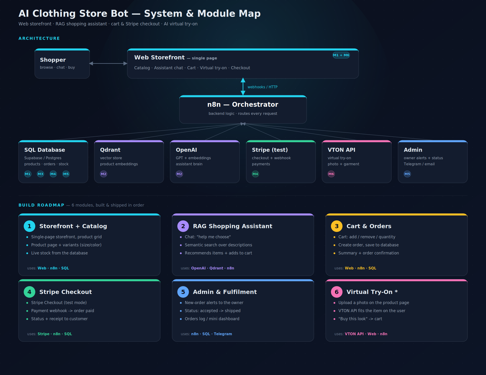

# FORM Store — AI Clothing Store

An end-to-end e-commerce storefront where the backend is an n8n orchestration layer rather than an application server. A shopper can browse a catalogue, ask an assistant what to wear, try a garment on their own photo, pay, and have the owner fulfil the order from Telegram.

Built as a portfolio project: it is not deployed, and Stripe runs in test mode. Everything else is real — real database, real vector search, real payment flow, real paid image API with a real budget to protect.

<!-- TODO: demo video link -->

---

## What it does

```
Shopper ⇄ single-page storefront ⇄ [webhooks] ⇄ n8n
                                                  ├── Supabase (Postgres)  catalogue, orders, stock
                                                  ├── Qdrant               semantic product search
                                                  ├── OpenAI               embeddings + assistant
                                                  ├── Stripe (test)        checkout + webhook
                                                  ├── FASHN                virtual try-on
                                                  └── Telegram             owner alerts + fulfilment
```



Nothing talks to anything directly. n8n is the only component holding credentials; the browser holds none.

---

## Modules

| # | Module | What it covers |
|---|--------|----------------|
| 1 | **Storefront + Catalog** | Single-page shop, 49 products with size/colour variants, live stock from the database |
| 2 | **RAG Shopping Assistant** | Semantic search over product descriptions, gender filtering, conversational memory, intent routing |
| 3 | **Cart + Orders** | Client-side cart with revalidation, atomic order creation, per-country address validation |
| 4 | **Stripe Checkout** | Checkout Sessions, HMAC signature verification, idempotent webhook, stock release on failure |
| 5 | **Admin + Fulfilment** | Telegram bot with inline buttons, owner-only access, guarded status transitions |
| 6 | **Virtual Try-On** | Photo upload, garment fitting via FASHN, layered looks, daily spend cap, "buy this look" |

Each module builds on the previous one.

---

## Stack

**n8n** — orchestration, 9 workflows
**Supabase (Postgres)** — 6 tables, 2 views, 4 stored procedures
**Qdrant** — vector store, 1536-dim, cosine
**OpenAI** — embeddings and chat completion
**Stripe** — Checkout, test mode
**FASHN** — virtual try-on API
**Telegram Bot API** — admin interface
**Vanilla JS** — single-file storefront, no framework, no build step

---

## Repository layout

```
db/
  schema.sql             tables, constraints, indexes, views
  functions.sql          the four stored procedures
  seed.sql               catalogue data
  rich_descriptions.sql  assistant-facing product copy
workflows/               n8n exports, credentials stripped
frontend/index.html      the entire storefront
docs/                    architecture map
.env.example             what has to be configured
```

`workflows/` was produced with `n8n export:workflow`, not the editor's Download button — the latter embeds credential bodies in the JSON.

---

## Running it locally

Requires Node.js, Docker, and accounts for Supabase, OpenAI, Stripe (test) and FASHN.

**1. Database.** In the Supabase SQL editor, run in order: `schema.sql`, `functions.sql`, `seed.sql`, `rich_descriptions.sql`.

**2. Vector store.**

```bash
docker run -p 6333:6333 -d --name qdrant qdrant/qdrant
```

**3. n8n.**

```bash
NODE_FUNCTION_ALLOW_BUILTIN=crypto npx n8n@2.30.7 start
```

Import the workflows from `workflows/`, then create the credentials listed in `.env.example`. Supabase needs a **Custom Auth** credential, not Header Auth — PostgREST wants `apikey` and `Authorization` simultaneously.

Run `M2 — Index products to Qdrant` once to build the vector index.

**4. Storefront.**

```bash
cd frontend && npx serve -l 8080 .
```

Open `http://localhost:8080`. The page derives webhook URLs from its own hostname, so it also works from a phone on the same network.

Stripe and Telegram need a public URL (`cloudflared tunnel`); the catalogue, cart and try-on do not.

---

## Engineering decisions

The interesting part of this project is not the feature list — it is what happens when two things go wrong at once.

### Stock cannot be checked and then decremented

Two shoppers buying the last item in a size will both pass a `SELECT` before either runs an `UPDATE`. `create_order` therefore never reads stock to make a decision:

```sql
update variants
set stock_quantity = stock_quantity - v_qty
where id = v_variant_id
  and stock_quantity >= v_qty;

get diagnostics v_updated = row_count;
if v_updated = 0 then
  raise exception 'Not enough stock for variant %', v_variant_id;
end if;
```

The condition is part of the write. There is no window between the check and the decrement. The loser's transaction rolls back entirely, so a partially-filled order cannot exist.

### Prices come from the database, never from the client

The cart lives in `localStorage` and is fully editable by the shopper. `create_order` accepts variant ids and quantities, looks the price up itself, and writes it into `order_items.price_at_purchase`. Copying the price at purchase time also means editing the catalogue never silently re-prices historical orders.

### Webhook idempotency belongs to the database

Stripe retries delivery until it receives a 2xx, so the same event arrives more than once. Rather than checking "have I seen this?" in workflow logic — which has the same race as the stock problem — `stripe_events.event_id` is a primary key. The duplicate insert fails outright.

The counterpart is `release_order`, which restores stock only if the order was still `pending`:

```sql
update orders set status = p_status
 where id = p_order_id and status = 'pending';
```

A checkout can expire while a cancellation is already in flight. Whichever call lands first wins; the second changes nothing and returns false, so stock is never returned twice.

### The signature is verified, not trusted

A webhook endpoint is a public URL that anyone can POST to. The Stripe workflow recomputes the HMAC-SHA256 of the raw request body against the signing secret and rejects anything that does not match — which is why `NODE_FUNCTION_ALLOW_BUILTIN=crypto` is required to start n8n at all.

### Admin actions are guarded by a row lock

Telegram inline buttons are trivially double-tapped, and the callback can be replayed. `advance_order_status` takes `SELECT ... FOR UPDATE` before deciding, and only permits `paid → accepted → shipped`. The second tap reads the already-updated status and is rejected as an invalid transition rather than silently repeating the action.

### The daily try-on cap is a budget control

Every try-on costs roughly $0.15 at FASHN, so the quota has to be reserved *before* the job starts, not after it succeeds. `increment_vton_usage` does the read, the limit check and the increment in one statement:

```sql
insert into vton_usage as vu (day, generations)
values (current_date, 1)
on conflict (day) do update
  set generations = vu.generations + 1
  where vu.generations < p_limit
returning vu.generations into v_used;
```

When the limit is reached the `UPDATE` matches nothing, `RETURNING` yields nothing, and the null tells the function the quota is spent. It counts *attempts* rather than successful generations — deliberately stricter, because a retry loop should not be able to drain the budget.

### Try-on results are URLs, not base64

FASHN can return the generated image inline. Doing so pushed a 2.2 MB payload through n8n, which truncated it. Switching to `return_base64: false` reduced the webhook response to a ~90-character CDN URL, extended result lifetime from 60 minutes to 72 hours, and made layering free: a previous result can be passed straight back as the next request's model image.

### Displacement is tracked, because the model replaces rather than layers

The try-on API swaps the garment in a given category instead of putting one on top of another. Trying a second t-shirt over the first produces an image with one t-shirt in it. The fitting room therefore models a saved entry as a *look*, and moves same-category items from `items` to `replaced` — otherwise "buy this look" would add two t-shirts to the cart when the photo shows one. Replaced pieces are offered separately at checkout rather than dropped.

### Validation is in the database, not only the form

The frontend can be bypassed by posting to the webhook directly, so country, phone format and postcode format are `CHECK` constraints. A Greek address cannot be stored with a Polish postcode regardless of what the client sends.

---

## Limitations

Stated plainly, because most of these are choices rather than oversights.

- **No deployment.** Runs locally. Out of scope for this phase.
- **No authentication.** Consequently the try-on quota is store-wide rather than per user. A per-person limit without accounts would rest on a `localStorage` id, which is a turnstile, not armour.
- **Stripe is in test mode.** No real money moves.
- **Try-on does not model fit.** The API renders the garment, not the size — the selected size is what goes into the cart, and the UI says so explicitly.
- **One photo per product**, so try-on shows the primary colour regardless of the variant selected.
- **Try-on results live 72 hours** on the provider's CDN. Persisting them would need object storage.
- **No automated tests.** Scenarios were verified manually, including all five Stripe payment outcomes.
